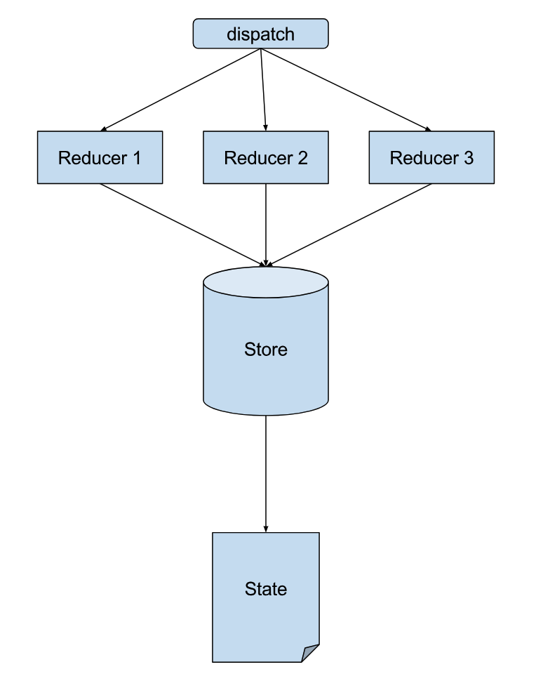
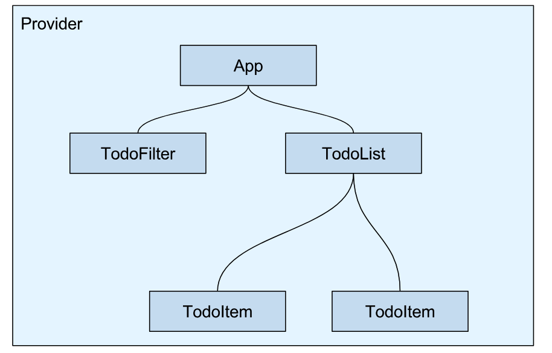
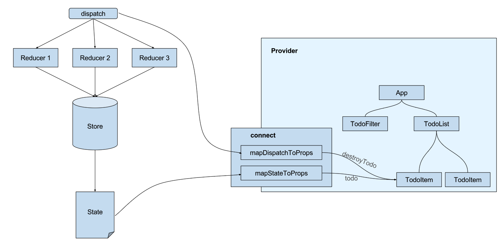

# how to use it

Redux use unidirectional binding

action -> dispatcher -> store -> react view ->--
|                                               |
|------------------------------------------------


## action: user interactions  
encapsulates events; tringgered by user interactions and server; passed to dispatcher   
payload has type and data
```
{
	type: USER_SAVED
	data: {
		firstName:'Cory',
		lastName:'House';
	}
}
```

## dispatcher: notify everyone who cares   
Central Hub - There's only one   
Holds list of callbacks   
Broadcasts payload to registered callbacks   
sends actions to stores

### Constants  
Keeps things organized   
provides high level view of what the app actually does    

## store: hold app state    
Holds app state, logic, data retrieval   
Not a model-contains models   
One app may have one store or many stores    
Registers callbacks with dispatcher(Only stores are allowed to register dispatcher callbacks. Components are not allowed to do so)    
Uses Node's EventEmitter    

The structure of a Store
```
Every store has these common traits(aka interface)
1 Extend EventEmitter
2 addChangeListener and removeChangeListener
3 emitChange
```

```
          dispatcher
             |
             payload
             |
    -------------------------------         
    |           |                 |
  userSTore    AddressStore     ProductStore
```

As an application grows, the dispatcher becomes more vital, as it can be used to manage dependencies between the stores by invoking the registered callbacks in a specific order. Stores can declaratively wait for other stores to finished updating, and then update themselves accordingly.


## react view:  
Controller view:  
top level components(recommend using single or limited number top level components)  
Interacts with Stores   
Holds data in state   
Sends data to children as props(from parents to children)   

## Flux Flow in Detail   

Action(user click "save user" button)<------> ajax call(web API)
   |
sendActionPayload(payload sent to dispatcher)
   |
dispatcher(checks for registered callbacks)
   |
sendActionPayload(sends payload to all registered callbacks)
   |
Store(receiveds payload)
   |
updates storage and fires change event(store updates and emits change event)
   |
reactView---go back to action


## Flux is actually a design pattern  
1 register(function callback)- "Hey dispatcher, run me when actions happen. -Store"     
2 unregister(string id)-"Hey dispatcher, stop worrying about this action. -Store"     
3 waitFor(array<string> ids)-"Update this store first. -Store"     
4 dispatch(object payload)-"Hey dispatcher, tell the stores about this action. -Action"   
5 isDispatching()-"I'm busy dispatching callbacks right now"  

## Flux vs Publish-Subscribe Model   
differs in two ways:   
1 every payload is dispatched to all registered callbacks   
2 callbacks can wait for other callbacks   


## connect() and Provider   

two pieces of React Redux middleware: connect() and Provider. The two pieces work hand in hand. Provider ensures that our entire React application can potentially access data from the store. Then connect(), allows us to specify which data we are listening to (through mapStateToProps), and which component we are providing the data. 

### Provider   
Provider ensures that our entire React application can potentially access data from the store.  

We imported Provider from React Redux  
We used Provider to wrap our React application  
We passed our store instance into Provider as a prop, making it available to all of our other components.   

```js
import React from 'react';
import ReactDOM from 'react-dom';
import { createStore } from 'redux';
import { Provider } from 'react-redux'; /* code change */
import shoppingListItemReducer from './reducers/shoppingListItemReducer';
import App from './App';
import './index.css';

const store = createStore(
  shoppingListItemReducer,
  window.__REDUX_DEVTOOLS_EXTENSION__ && window.__REDUX_DEVTOOLS_EXTENSION__()
);

ReactDOM.render(
  <Provider store={store}>
    <App store={store}/>
  </Provider>, /* code change */
  document.getElementById('root')
);

```

We just did a few things here:

We imported Provider from React Redux   
We used Provider to wrap our React application    
We passed our store instance into Provider as a prop, making it available to all of our other components.   


### connect    
Then connect(), allows us to specify which data we are listening to (through mapStateToProps), and which component we are providing the data.   

```js
const mapStateToProps = (state) => { 
  return { items: state.items };
};

connect(mapStateToProps)(App);

```

## sample code    

```js
var AuthorPage = React.createClass({
  getInitialState: function() {
    ...
  }

  componentWillMount: function() {
    AuthorStore.addChangeListener(this._onChange);
  },
  componentWillUnmount: function() {
    AuthorStore.removeChangeListener(this._onChange));
  },
  _onChange: function() {
    this.setState({ authors: AuthorStore.getAllAuthors()});
  },
})

```

## redux in pictures
```
redux state management flow
1 the only way to modify the store is through reducers

2 the only way to trigger reducers is to dispatch actions 
to change data, we need to dispatch an action  
to obtain data we need to get the current state of the store  

```



```
Provider
a React component used to "provide" the store to its child components
```



```
Connect

connect() is a function that injects Redux-related props into your component.
You can inject data and callbacks that change that data by dispatching actions.
```



## summary   
Flux is a pattern for unidirectional data flows   
actions encapsulate events   
dispatcher is a central hub that holds callbacks   
stores hold app state   
flux has many implementations   


